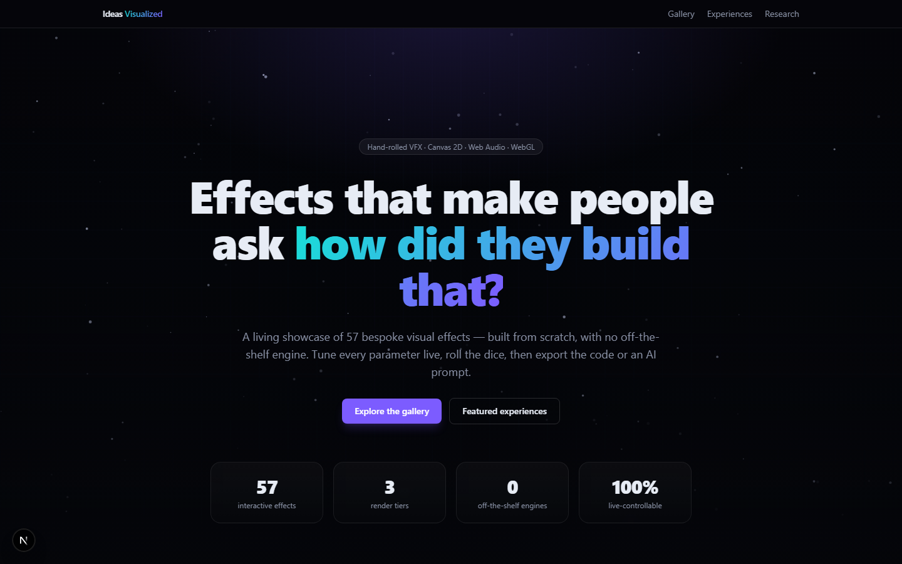
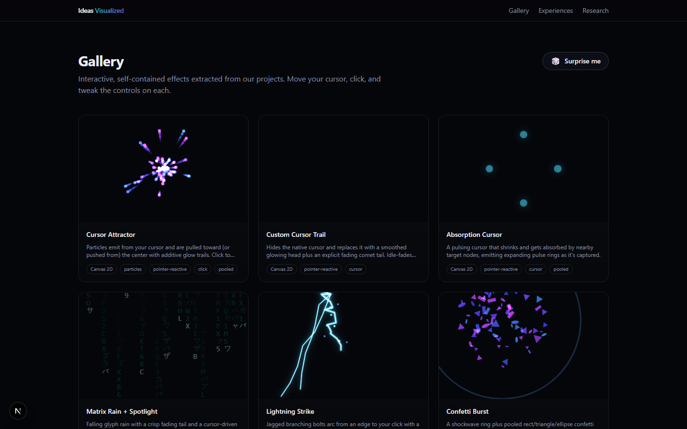
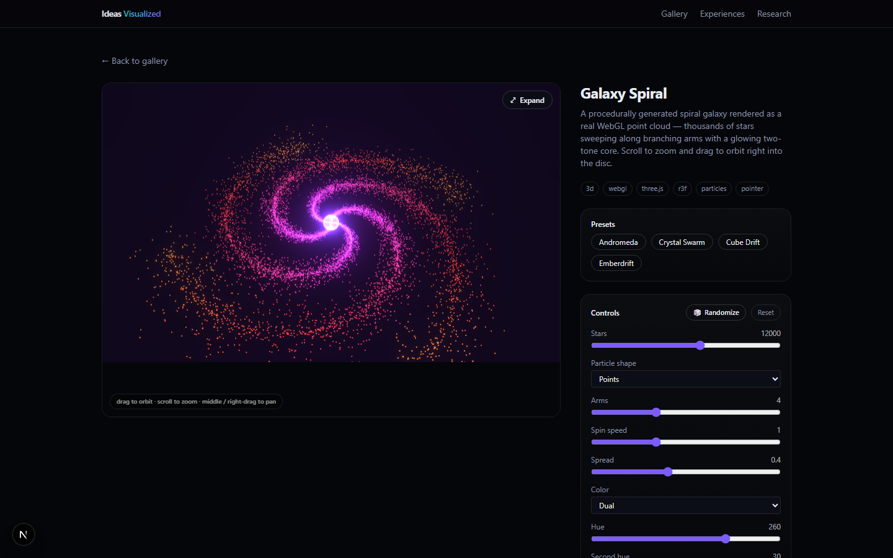

<div align="center">

# Ideas Visualized

### Effects that make people ask *"how did they build that?"*

**An interactive showcase of 57 bespoke visual effects — Canvas 2D, pseudo-3D, and true WebGL — each one live-controllable, randomizable, and exportable.**

[](https://ideas-visualized.vercel.app)
[](./LICENSE)


[**🔗 Open the live demo →**](https://ideas-visualized.vercel.app)



</div>

---

## Why this exists

Inspired by [wawa-vfx](https://github.com/wass08/wawa-vfx), but **stepped up**. Instead of one page of generic R3F particle tiles, every effect here is a hand-rolled, parameterized module with:

- **Live controls** — sliders, toggles, selects, color pickers, text inputs (with conditional visibility).
- **Single / Dual / Rainbow** color modes on a unified palette system.
- **Curated presets** + a **🎲 randomize** button (or press `R`), plus a global "Surprise me."
- **Code export** — generate an AI prompt to recreate the look, *or* copy a self-contained React component.
- **Expand / fullscreen** for any effect.

No off-the-shelf engine. The craft is in the hand-written particle physics, object pooling, culling, and audio→visual mapping.

## The gallery



### 57 effects across three render tiers

| Tier | Examples |
|---|---|
| **Canvas 2D** | Particle Constellation · Nova Burst · Aurora Veil · Nexus Card · Charge Burst · Matrix Rain · Lightning · Corner Fireworks · Absorption Cursor · Ripple Distortion |
| **Pseudo-3D** | Wireframe Cubes · Chain Detonation · Depth Tunnel |
| **True WebGL** (R3F) | Galaxy Spiral · Nebula Cloud · Particle Morph · Vortex Tree · Crystal Core · Torus Knot · DNA Helix · Hyperdrive · Wave Grid |

All WebGL scenes support **orbit / scroll-to-zoom / pan** camera control with bloom.

<div align="center">



</div>

## Built for performance

- **No ghosting by default** — a crisp `clearMode: "full"` harness; motion trails are drawn explicitly rather than via accumulating fades (which asymptote due to 8-bit rounding).
- **Object pooling** — particle-heavy effects reuse instances instead of allocating/GC-ing per frame.
- **Off-screen pause** — `IntersectionObserver` halts the render loop when an effect scrolls out of view; tab-visibility aware.
- **DPR-capped + delta-timed** — sharp on retina, frame-rate-independent motion.
- **Reduced-motion aware** — respects `prefers-reduced-motion`.

## Beyond the gallery

- **Experiences** — *Simon Says*, a memory game driven by the custom **absorption cursor**, and *Ideas in Motion*, a scroll-driven parallax journey.
- **Research** — write-ups on the techniques: fixing canvas ghosting, object pooling, and best practices for reactive, particle-heavy scenes.

## Tech stack

[Next.js](https://nextjs.org/) (App Router) · TypeScript · Tailwind CSS · Canvas 2D + Web Audio · [React Three Fiber](https://github.com/pmndrs/react-three-fiber) + [drei](https://github.com/pmndrs/drei) + [postprocessing](https://github.com/pmndrs/react-postprocessing)

## Getting started

```bash
npm install
npm run dev      # http://localhost:3000
npm run build    # production build
```

## Project structure

```
app/                     Routes (gallery, gallery/[slug], experiences, research)
components/
  effects/<slug>/        One self-contained module per effect
  effects/useCanvas2D.ts Shared Canvas 2D harness (clear policy, DPR, pointer, pause)
  effects/three/Stage3D  Shared R3F scaffold (orbit/zoom/pan + bloom)
  EffectDetail.tsx       Interactive view: controls, presets, randomize, export, fullscreen
lib/effects/
  meta.ts                Server-safe metadata (slug, controls, presets) for every effect
  registry.tsx           Slug → React component map (client)
  color.ts               Single / Dual / Rainbow palette helpers
docs/                    Catalog, plan, roadmap, research notes
```

### Adding an effect

1. Create `components/effects/<slug>/index.tsx` exporting a named component `({ params }) => ...`.
2. Add an `EffectMeta` entry (slug, controls, presets) to `lib/effects/meta.ts`.
3. Register the component by slug in `components/effects/registry.tsx`.

The gallery, detail page, controls, presets, randomize, and export all wire up automatically.

## License

[MIT](./LICENSE) © Idea-R
